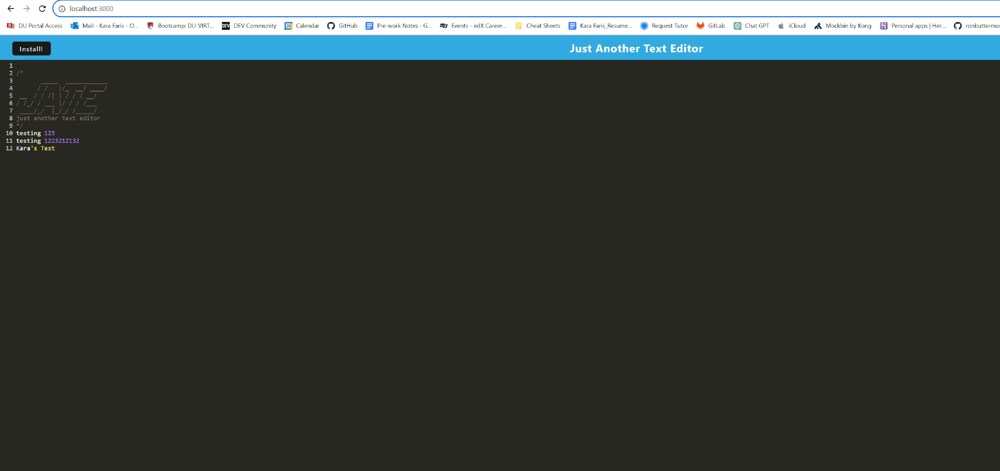

# Text Editor

## The inspiration behind building this project stemmed from the desire to create a versatile web-based text editor that addresses the challenges of working in various connectivity conditions. The goal was to offer users a platform where they can generate and store notes or code snippets both online and offline. By implementing integrated service workers and Cache API, the application retains its functionality even without an internet connection, providing uninterrupted access to stored content and previously visited pages. This project aimed to solve the problem of users needing a reliable tool for note-taking and coding tasks, irrespective of their current internet status. Throughout the development process, valuable insights were gained into effectively leveraging service workers and Cache API to enhance web application functionality, as well as the importance of creating seamless user experiences across different network environments.

## User Story
AS A developer
I WANT to create notes or code snippets with or without an internet connection
SO THAT I can reliably retrieve them for later use

## Acceptance Criteria
GIVEN a text editor web application
WHEN I open my application in my editor
THEN I should see a client server folder structure
WHEN I run `npm run start` from the root directory
THEN I find that my application should start up the backend and serve the client
WHEN I run the text editor application from my terminal
THEN I find that my JavaScript files have been bundled using webpack
WHEN I run my webpack plugins
THEN I find that I have a generated HTML file, service worker, and a manifest file
WHEN I use next-gen JavaScript in my application
THEN I find that the text editor still functions in the browser without errors
WHEN I open the text editor
THEN I find that IndexedDB has immediately created a database storage
WHEN I enter content and subsequently click off of the DOM window
THEN I find that the content in the text editor has been saved with IndexedDB
WHEN I reopen the text editor after closing it
THEN I find that the content in the text editor has been retrieved from our IndexedDB
WHEN I click on the Install button
THEN I download my web application as an icon on my desktop
WHEN I load my web application
THEN I should have a registered service worker using workbox
WHEN I register a service worker
THEN I should have my static assets pre cached upon loading along with subsequent pages and static assets
WHEN I deploy to Heroku
THEN I should have proper build scripts for a webpack application

## GitHub Repository 
https://github.com/karafaris/TextEditor.git

## Heroku URL
https://git.heroku.com/texteditor-2023.git

## Screenshots

## Installation
CLONE the Github remote repository to your local desktop
Run npm i within the root directory
Lastly run npm start to activate the server
Users are run it locally by entering into their browser http://localhost:3000/ or by visiting the app
Next you are able to install the app instead of using it on the browser by clicking the "Install" button

